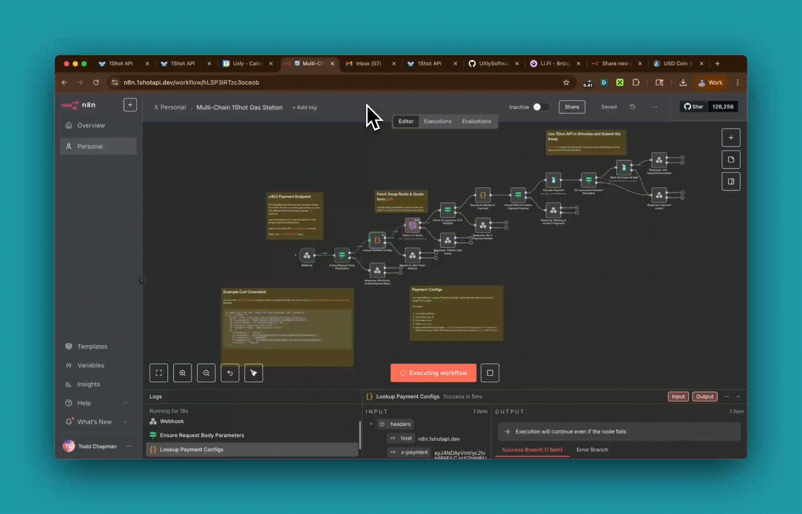

[](https://youtu.be/IbeMF85k8yY)

# 1Shot API Gas Station

The 1Shot API Gas Station contract is meant to be used with an [x402](https://x402.org) relayer gateway to allow users to swap ERC-20 tokens for native gas tokens when they don't have any funds to pay for transaction fees. 

The Gas Station contract uses [Li.Fi](https://li.fi/) to perform swaps, and is designed to roughly mimic how the [Permit2Proxy](https://github.com/lifinance/contracts/blob/main/src/Periphery/Permit2Proxy.sol) contract works in the Li.Fi periphery. 

## n8n



A complete n8n relayer workflow is provided [here](./n8n.json) for serving the Gas Station as an API. 

## Gas Station Details

The [GasStation1Shot.sol](/contracts/GasStation1Shot.sol) contract can only be used with ERC-20 tokens that are [EIP-3009](https://eips.ethereum.org/EIPS/eip-3009) compatible, (like [USDC](https://github.com/FraxFinance/fraxtal-usdc) and USDT) and it is intended only to swap a users tokens into native coins. 

There are three checks performed internally:

1. The function signature on the `diamondCalldata` is ensured to correspond to one of the Li.Fi functions which swap to native coins (the swap is guaranteed to produce native coins).
2. The recipient of the native tokens is ensured to be the same address as the address which signed the EIP-3009 authorization (the authorizor is guaranteed to be the recipient of the output of the swap).
3. All funds authorized to be swapped by the user are ensured to be swapped (i.e. the relayer cannot input `diamondCalldata` that will leave residual tokens in the Gas Station after the transaction). 

The slippage and fee data is set by the person/relayer who submits the transaction and is not guaranteed for the end user since this would require a second signature for the user to sign. The intention is that this Gas Station swap contract would only be used to procure small amounts of native token, so there is low risk to the user to lose substantial funds. 

## Try It Out

You can try [1Shot API's Gas Station Webapp](https://1shotapi.com/gas-station) or hit the API directly with curl and a [valid x402 header](https://1shotapi.com/tools)):

> [!Note]
> Leave the x-payment header out to get back a swap quote in the 402 response.

```sh
# Be sure to put a valid x-payment header (https://1shotapi.com/tools)
# and also set appropriate values for the from/to chains, fromAddress and amount
curl -X POST \
  https://n8n.1shotapi.dev/webhook/gas-station \
  -H "x-payment: YOUR-BASE64-ENCODED-PAYMENT-PAYLOAD" \
  -H "User-Agent: CustomUserAgent/1.0" \
  -H "Accept: application/json" \
  -H "Content-Type: application/json" \
  -d '{
    "fromChain": "43114",
    "fromToken": "0x9702230A8Ea53601f5cD2dc00fDBc13d4dF4A8c7",
    "fromAmount": "1000000",
    "fromAddress": "0x55680c6b69d598c0b42f93cd53dff3d20e069b5b",
    "toChain": "43114"
  }'
```

## Hardhat Cheatsheet 
Try running some of the following tasks:

```shell
npx hardhat vars set INFURA_API_KEY
npx hardhat vars set PRIVATE_KEY
npx hardhat vars set ETHERSCAN_API_KEY
npx hardhat ignition deploy ./ignition/modules/GasStation1Shot.ts --network base --strategy create2
npx hardhat ignition verify chain-<chainId> --include-unrelated-contracts
npx hardhat x402-gas-station --tokenaddress 0x833589fcd6edb6e08f4c7c32d4f71b54bda02913 --amount 100000 --network base
```

## Deployments: 

- Base - [0x4E43836F329B5f176A5d1a21519d0C61f819429C](https://basescan.org/address/0x4E43836F329B5f176A5d1a21519d0C61f819429C)
- Arbitrum - [0x4E43836F329B5f176A5d1a21519d0C61f819429C](https://arbiscan.io//address/0x4E43836F329B5f176A5d1a21519d0C61f819429C)
- Avalanche - [0x4E43836F329B5f176A5d1a21519d0C61f819429C](https://snowtrace.io/address/0x4E43836F329B5f176A5d1a21519d0C61f819429C)
